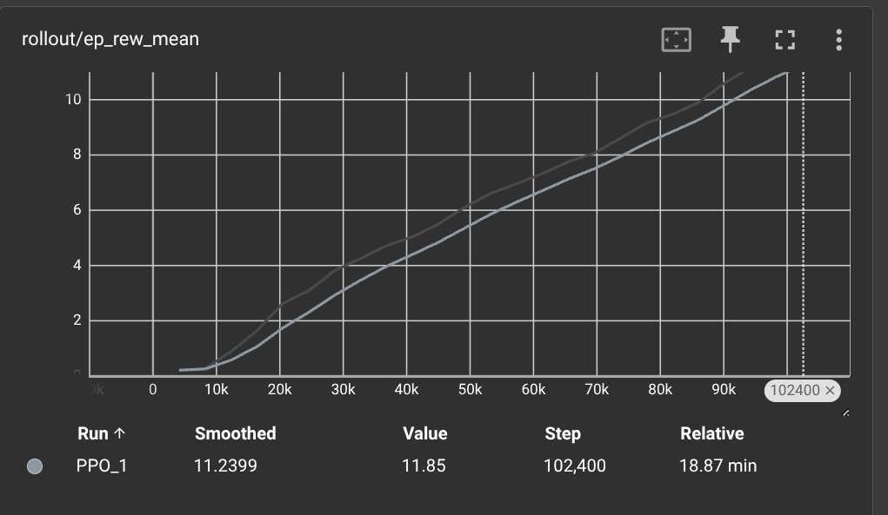

# Final Project
This repository has the final project for SOC.
## Problem Statement
The aim of this project is to create and train an agent to play the DOOM game. This version of DOOM is called defend the center. Inside the game, the player/agent has fixed (i.e 30) ammo for firing against continuously spawning demons and can take 1 of the following 3 actions:  
1.Turn Left  
2.Turn Right  
3.Fire  
Since the ammo is finite, the game is destined to terminate at some point of time. The goal of the agent is to play the game for as long as possible by killing the demons without wasting ammo.  

### Structure
The .ipynb file has the step by step code for creating env, training and testing the models.
The log folder has tensorboard files which can be used to view stats while training.
The models folder has 2 trained models over 100k steps which can be imported and used.

### Reward over time during training the models with 2 different algorithms:-

Above code has been run in a virtual env created in linux os with the required libraries which are also mentioned in code.  

## Video Explanation
Below is the link containing a video explaining the problem, results and code:  
https://drive.google.com/drive/folders/1lVAeKP7eFBZh4LVytYtqWHygbvCSnfwb?usp=sharing

