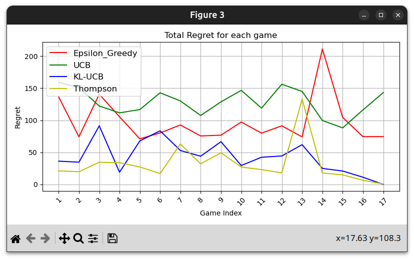

## Explanation for the graph obtained in S2 set of games

According to the above figure from 2nd part of the games, we see that there is flucuation as p increases from 0.1 to 0.9 in steps of 0.05. This is due to randomness as we have not averaged over many runs.
KL-UCB and UCB both give upper bound for the true mean of the arm but KL-UCB gives much better bound. Therefore we can see it always having lesser regret than UCB.
When p is near 0.1, p and p+0.1 are clearly different so they have low regret. In between we can see higher regrets as arms are harder to distinguish.